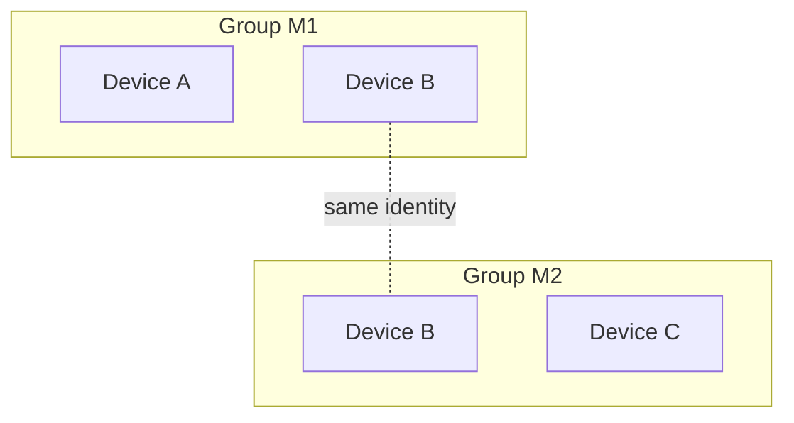

# Multimesh groups design

## Status

Accepted design and the next AFM work item. Implementation is in progress
through the [implementation PRs](#implementation-prs).
It generalizes the single mesh from [QR mesh pairing](../qr-mesh-pairing/plan.md)
into many independent groups per device, and gives the
[first file-transfer roadmap](../first-file-transfer/plan.md) its catalog shape:
one catalog per group instead of one per device mesh. Multi-membership lands
before that roadmap's stage 2 UX, so the file screens are designed around groups
from the start.

Permissions are deliberately absent: every member of a group can do everything
any other member can. Leaving is the one action a device can only take for
itself.

## Outcome

1. A device belongs to any number of **groups**. Each group has a name, a set of
   member devices, and a tree of files, like a shared drive.
2. Any member can add a device to that group, add files and folders, rename or
   move them, remove them, and download any file another member added.
3. Any member can leave a group at any time, including while offline, and can
   be added back later.
4. Groups are isolated. A device only in group A learns nothing about group B:
   not its name, members, addresses, files, or bytes.
5. The same file added to two groups is stored once on a device.
6. Existing AFM installs keep their current mesh as their first group.

## Terms

| Term | Meaning |
|---|---|
| Device | One Spirit node identity (Ed25519 key, iroh endpoint ID). Unchanged. |
| Group | One Spirit mesh. AFM says "group"; Spirit keeps saying "mesh". |
| Member | A device admitted to a group and not departed. Members are devices, not people. |
| Generation | How many times a device has joined a group, counting from 0. Leaving ends the current generation, and re-joining starts the next one. |
| Departure | A device's signed record that it left a group at a given generation. |
| Catalog | AFM's replicated file tree for one group. |
| Store | The device's one content-addressed blob store, shared by all groups. |

## Decisions

### A group is exactly one Spirit mesh

Spirit meshes already have the required no-permissions semantics: random
`mesh1_...` IDs, a signed append-only admission set, and any member may admit
another device. Reusing them avoids a second membership system in AFM.

Alternative rejected: one mesh per device with AFM-level groups inside it. Every
device would then authenticate to every other device's groups, so isolation would
depend on AFM filtering rather than on Spirit's membership checks.

### Members are devices

People are expected to have, for example, a personal group across their phone
and laptops and a work group that only their work laptop joins. Device-level
membership expresses that directly, and each device joins only the groups it
should hold. Account or person identity is not planned.

### One device identity across all groups

A device keeps its single key and endpoint and joins many meshes with it.

| | One identity, many meshes (chosen) | One identity per group |
|---|---|---|
| Endpoints and relay connections | One | One per group |
| Heartbeats to a peer shared by several groups | One | One per group |
| Android battery and background cost | Unchanged | Grows with groups |
| Recognizing the same peer across groups | Yes | No |
| Cross-group linkability | Members of two groups can see they share a device | None |

The linkability cost is acceptable for small personal, friend, and work groups,
and it is stated in the privacy copy. A work laptop that joins only the work
group is not linked to the personal group at all. Per-group identities can be
added later for groups that need them without changing the rest of this design.

### Isolation is enforced by Spirit, per request

Every exchange names one mesh, and the responder authorizes the remote device
against that mesh only:

- Membership snapshots and addresses sent for mesh M contain only M's members.
  `Snapshot::verify` already rejects addresses of non-members.
- A request for a mesh the responder is not in, or that the requester is not
  in, gets the same generic failure after the same verification work. The
  responder checks the requester's membership, including a departure it
  already knows about, before any merge. Neither the reply nor its timing
  reveals whether the responder is in the mesh; any remaining measured gap is
  recorded in Spirit's node design. No metadata is returned.
  The one exception is a device that left a mesh: it answers that mesh's
  members with its own
  departed copy, so they learn it left.
- Ping and presence are per device. A device answers a ping from any device it
  shares at least one mesh with.

Example: B is in groups M1 {A, B} and M2 {B, C}. A and C never learn about each
other or about the other group, A cannot ping C, and B's heartbeat to each peer
only syncs the meshes it shares with that peer.



### The scanner chooses the group

The `spirit1` ticket stays exactly as it is: "add me to a group", with no group
named. The member scanning it chooses the target by opening a group and choosing
**Add device**. The receiving device accepts enrollment into a new mesh instead
of rejecting it because it already belongs to another one. It shows
"Added to *group* by *device*".

The ticket remains a five-minute, single-use bearer credential. Showing it lets
its holder add the device to any one group of their choosing, and the privacy
copy says so. A device added to an unwanted group simply leaves it.

Fresh apps still never create a group on their own. AFM stops creating the
constant `AFM mesh` on the first scan. Users create groups explicitly, and
scanning only happens from inside a group.

### Group files live in an AFM catalog, bytes live in the one store

This keeps the existing ownership boundary: Spirit owns identity, membership,
authorization, and verified bytes; AFM owns names, folders, and the file tree.
Spirit gains no record system or application schema.

- Each group's catalog is a set of signed AFM operations (below), stored under
  AFM's non-backup data directory next to the node identity.
- Bytes are imported once into the device store. A catalog entry refers to them
  by BLAKE3 hash, so the same file in two groups is one blob.
- Adding metadata to a group does not copy bytes to every member. Download stays
  explicit, as in the roadmap.

### Blob access is authorized per group

Knowing a hash must not grant access, including to members of *other* groups on
the same device. Spirit keeps a local, non-replicated **share set** per mesh:

- `share(mesh, hash)` and `unshare(mesh, hash)` are called by AFM.
- A fetch request names `(mesh, hash)`. It is served only if the requester is a
  member of that mesh, the hash is in that mesh's share set, and a verified local
  copy exists. Every other case returns the same "unavailable" error.
- AFM keeps each share set equal to the hashes of live file entries in that
  group's catalog. It reconciles the set at startup and on every catalog change.
  A member that downloads a file can therefore serve it to other members.

Alternatives rejected: letting anyone who shares any mesh fetch any hash leaks
across groups and allows "do you have this file" probing. A Spirit-to-AFM
authorization callback on every fetch ties serving to the app's runtime and
does not suit a store later shared with the CLI or Kai.

### Everyone is equal

No roles, owners, or admin actions. The founder remains only the anchor for
mesh signature validation, as it is now, and is not a coordinator. The founder
can leave like anyone else. Any member can admit devices and change any catalog
entry. Trust is transitive: admitting a device trusts it to admit others.

### Leaving is a cooperative, signed departure

A device leaves by signing a departure for its current generation. Nobody else can
sign one for it, so leaving adds no permission rule. Membership stays
append-only and merges as a union of signed records, as implemented in
[Spirit2 #9](https://github.com/abysl/spirit-library2/pull/9):

- A device is a current member of a mesh if its highest-generation admission
  has no departure.
- Re-adding a departed device signs a readmission at the next generation. The
  normal scan flow does this.
- Admissions a device signed stay valid after it leaves, including those of
  devices it admitted and the founder's founding admission, so leaving never
  removes anyone else.
- Listing, heartbeats, pong authorization, and admitting others use current
  members only.

Leaving is cooperative, **not key revocation**. Records a departed key signs
afterwards still verify. Closing a departed key would protect almost nothing:
every member is equal, so a malicious member could admit a device of its own
before leaving, and that device would keep full rights. The protection against
a malicious member is removing it, which is deferred. An earlier draft of this
plan closed departed keys by having departures list what the device signed.
Review showed that a departed key could re-sign its departure to regain trust
or evict the devices it admitted, and a sound version needs a new witness
protocol. It was dropped for that reason.

An honest departed device signs nothing more in the group. It keeps only a
departed copy, used to deliver its departure (below).

Leaving takes effect locally at once, even offline:

1. AFM asks for confirmation.
   - The dialog warns that files only this device holds become unavailable to
     the group.
   - It also warns that catalog changes no other member has acknowledged yet
     will be lost.
   - If this device is the only current member, it says the group will be
     deleted.
2. Spirit signs the departure and records the mesh as **departed**. From then
   on the device does not authorize anyone for that mesh: no app requests,
   fetches, shares, or pings. It answers the mesh's members only with its
   departed copy (step 4). While it keeps that copy, the only enrollment into
   the mesh it accepts is a readmission at the next generation, which makes it
   a member again.
3. AFM removes the group from its UI, unshares its hashes, and deletes its
   catalog.
4. Spirit pushes the departure once, in parallel, to every former member on
   `spirit/depart/1`, and reports how many it reached. One notified member is
   enough, because membership gossip relays the departure to the rest. Members
   that were unreachable learn it later, either from a notified member or by
   pull: the device keeps a **departed copy** of the mesh and returns it
   whenever a member syncs with it.
5. The departed copy also refuses a stale introducer's generation-0 enrollment.
   It returns the departure, so the introducer can retry once with a
   readmission. The copy is removed when the device is readmitted. It is never
   kept if no current members remain, because nobody could need it. At most 64
   departed copies are kept, in a persisted departure order, and the earliest
   is evicted first.

Evicting a copy, which takes 64 later departures, loses pull delivery and the
stale-enrollment refusal for that mesh. Members that were never reached keep
listing the device. A stale introducer's generation-0 enrollment then rejoins
the device on its side only, and informed members keep rejecting it. The
recovery is to leave again and be readmitted.

A departed device still learns full snapshots, with members and addresses,
from members that have not yet heard of its departure, and from stale
introducers.

Files the device downloaded stay in its store until the store has application
references (SPIRIT-02). After that, AFM deletes blobs that no remaining group
references. Until then the confirmation says the bytes stay on the device.

Removing another member is not part of this design. With equal permissions,
any member could remove any other, which needs its own conflict rules.

## Spirit2 changes

These belong in `deps/spirit2` and are reviewed and published there before AFM
moves its pin.

### State

`State.mesh: Option<Mesh>` becomes `meshes: BTreeMap<MeshId, Mesh>` for the
meshes this device is currently in. #9's `departed` map of departed copies,
with its persisted `departure_order` and 64-entry bound, stays beside it
unchanged, so a device can be a member of one mesh while holding a departed
copy of another.

The address book is keyed by device. For each device it holds at most one
**direct** address, taken from the device's own entry in a snapshot it sent,
and at most one **hint per mesh**, relayed by a third party in that mesh. An
address cannot exist without its source. `snapshot(M)` includes, for each of
M's current members, the direct address if there is one, otherwise the hint
learned in M. A hint from another mesh is never forwarded, so a member of one
group cannot plant a relay or IP address for a shared device and have it
forwarded to another group's members, whose addresses it would then reveal.
A newer hint from the same mesh replaces the older one, and a hint never
replaces a direct address. A mesh's hints are dropped when this device leaves
that mesh, or when the device they describe stops being a current member of
it. Dialing may use any stored address, direct first. Senders trim their own
and forwarded addresses to 16 transports, each at most 160 serialized bytes, so
one oversized address never breaks a snapshot. Real iroh relay URLs are about
47 bytes.

On first open, a legacy `mesh` field migrates into a one-entry map through the
existing atomic write. Its stored addresses become hints for that mesh, because
the old format did not record which ones came from the device itself; direct
contact upgrades them. Legacy mesh IDs and signatures are kept unchanged. Older
Spirit builds ignore unknown fields, so the new state writes a `"mesh"`
sentinel string that their deserializer rejects. They therefore fail to open a
migrated directory instead of reading it as not enrolled and erasing every
group on their next write. The release notes must say that downgrading is not
supported.

Bounds per device and per mesh:

- At most 64 current meshes per device, plus at most 64 departed copies.
- At most 256 current members per mesh.
- At most 256 admission records per mesh, readmissions included, as in #9.
  Every departure matches an admission and is unique per device and
  generation, so departures never exceed admissions and a history never
  exceeds 512 records. Leaving therefore never fails for capacity. A capacity
  bound on total records would have to either refuse a departure or be
  exceeded by one, and a reservation checked only at admission time cannot
  survive concurrent merges. When a mesh reaches 256 admissions, it refuses
  further joins and rejoins with an explicit "group membership history is
  full" error. Compacting that history is deferred.
- The `mesh/2` and `pair/2` message limit is 1 MiB. It fits both extremes:
  256 current members, and 256 admissions with 256 departures. Each case uses
  worst-case 128-byte names, which JSON escaping can double, and 16
  transports of 160 bytes per member.

### Membership records

The encoding follows [Spirit2 #9](https://github.com/abysl/spirit-library2/pull/9):

- Generation-0 admissions keep their existing `/1` or `/2` signed bytes and
  JSON form, so no stored signature changes.
- Re-adding a device signs a readmission,
  `("spirit/mesh/readmission/1", mesh_id, founder, mesh_name, member, issuer, generation)`.
  It is valid only after a departure from the previous generation.

A departure is self-signed over
`("spirit/mesh/departure/1", mesh_id, founder, mesh_name, member_id, generation)`.
As in `admission/2`, `mesh_id` is the canonical text ID and `founder` is
optional; legacy meshes have none. Admissions and departures are unique per
device and generation, and merge keeps the record it already holds for a key.
Concurrent readmissions of one device by two members can therefore store
different issuers on different members, while membership converges.

Verification keeps the existing order-independent trust closure from the
founding admission:

- Each admission and departure is validly signed and unique per device and
  generation.
- Each departure matches an admission, and each readmission follows a departure
  from the previous generation.
- Every issuer is reachable from the founder through admissions.
- Admissions of one device at the same generation carry the same nickname.

Two valid copies can still fail to merge, in both directions:

- **Admission cap:** their combined admissions exceed the cap, which is
  "invalid mesh size" in #9. Readmissions count toward it, so leave and rejoin
  cycles use it up for good. Compacting the history is deferred.
- **Nickname conflict:** readmissions for the same device and generation carry
  different nicknames, which is "conflicting device nickname". Only a dishonest
  signer can cause this, because nicknames are fixed at initialization.

### Protocols

The readmission and departure records land first, in PR #9, on the existing
`/1` protocols. S2 changes
routing, so pairing and membership then move to version 2 together. Every
device in a group must update, and a device on `/1` fails its membership sync
and appears offline to updated peers. AFM ships through one prerelease channel,
so no `/1` compatibility path is kept.

| Protocol | Behavior |
|---|---|
| `spirit/pair/2` | The receiver joins the snapshot's mesh if it is new, or merges into it if it is already a member, even if it belongs to other meshes. A receiver holding a departed copy of that mesh refuses a generation-0 enrollment from an introducer with the same mesh identity, and replies with its departure. The introducer merges that reply and retries once with a readmission at the next generation, using the same ticket, which is still unconsumed. The introducer merges the joiner's reply only into the mesh it admitted the joiner to, with the same identity, so a joiner cannot put the introducer into another mesh. Other refusals use one generic reply. |
| `spirit/mesh/2` | Uses the same snapshot exchange, routed by the request snapshot's mesh ID, with a 1 MiB message limit. The request snapshot is verified before any local state is consulted. The responder replies with that mesh's snapshot only if both sides are current members. Merging never creates a mesh; only `pair/2` joins one. A device holding a departed copy returns it only to members of a request snapshot with the same mesh identity: same ID, name, and founder. Knowing a mesh ID is not a credential. Every other case, including a device the responder knows has departed, gets the generic failure. |
| `spirit/depart/1` | Added by #9. Pushes the departing device's own signed departure for one mesh, once, at leave time. Receivers verify before consulting local state, and accept only the authenticated sender's own departure for that mesh. |
| `spirit/ping/1` | Unchanged wire format. It is authorized if the remote device is a current member of any mesh this device is currently in. |
| Heartbeat loop | Covers every current member of every mesh this device is currently in. Each peer gets one ping per interval. Before it, each mesh shared with that peer is synced independently and concurrently within a named sync budget: the heartbeat deadline minus a reserve for the ping. When the budget runs out, the meshes still pending are recorded by ID. A manual ping syncs with the normal request deadline instead. One mesh's sync failure is recorded but never blocks the other meshes or the ping. Departed copies are delivered by pull and are never heartbeated. |

### New primitives used by the catalog and transfer

| Primitive | Purpose |
|---|---|
| Mesh-scoped app request (`spirit/app/1`) | Sends an opaque request to one peer, tagged with a mesh ID and an application protocol name such as `afm/catalog/1`. Spirit authenticates the peer and checks that both sides are current members before calling the registered handler with `(mesh, peer, bytes)`. Messages are limited to 256 KiB, with bounded concurrency. |
| Application signatures | `sign(domain, bytes)` and `verify(device, domain, bytes, signature)`, computed over `("spirit/app-signature/1", domain, bytes)`, so application signatures can never be valid admissions. |
| Per-mesh share set and mesh-scoped fetch | As described above; it extends the SPIRIT-05 transfer work. |

### KMP contract sketch

```kotlin
data class MeshMember(val id: String, val generation: Long)
data class MeshStatus(
    val id: String,
    val name: String,
    val members: List<MeshMember>,
)
data class NodeStatus(val id: String, val name: String, val meshes: List<MeshStatus>, val devices: List<NodePeer>)

interface MeshNode {
    suspend fun status(): NodeStatus
    suspend fun createMesh(name: String): String
    suspend fun pair(): PairingInvitation
    suspend fun add(meshId: String, ticket: String): String
    suspend fun leaveMesh(meshId: String): LeftMesh
    suspend fun ping(device: String): NodePong
    suspend fun shutdown()
}
```

`meshes` lists only the meshes this device is currently in, and `members`
lists current members with their current generation. `devices` is the
deduplicated set of peers across those meshes, each with one presence value.
`leaveMesh` gains a mesh ID parameter and returns #9's `LeftMesh`, which
carries the mesh ID, the mesh name, and the remaining and notified member counts. The CLI
gains `--mesh` selection for `mesh add`, `mesh members`, and the `mesh leave`
command that #9 added.

The single-mesh `PairingSession` in the KMP `mesh` module splits into a
node-wide session and a per-group session:

- The node-wide session owns node lifecycle, this device's ticket, device
  presence, and the group list.
- The per-group session owns the group's members, the add-device action, and
  leaving.

## Catalog model

Each group's catalog is an operation-based set in which operations never
conflict. Each operation is stored and exchanged as:

```text
CatalogOp {
  mesh:   MeshId
  author: NodeId
  generation: u32        the author's membership generation in this mesh
  seq:    u64            contiguous per (mesh, author, generation), starting at 1
  body:   Add { entry: EntryId, kind: File | Folder, path: [segment], hash?, size? }
        | Remove { entry: EntryId }
  signature              Spirit application signature, domain "afm/catalog/op/1"
}
```

- `EntryId` is 16 random bytes. The tree is every `Add` whose entry has no
  `Remove`. A `Remove` that arrives before its `Add` is kept.
- Rename, move, and replace are a `Remove` followed by an `Add` for the same
  hash, so no bytes move.
- Removing a folder removes every entry the remover can see under it. A file
  that another member added concurrently survives, and its folder reappears
  implicitly from its path.
- When two live entries share a path, both are shown, labeled with the author
  device's name. Nothing is renamed or merged automatically.
- An operation is accepted only if its signature verifies, its mesh matches,
  and its author holds a trusted admission at that generation. Like
  membership, this is not revocation: operations a departed device signs later
  still verify.

  If a second, different operation arrives for an existing
  `(author, generation, seq)`, the first is kept and the conflict is surfaced as an
  error.
- A device writes its next `seq` durably before publishing an operation. The
  catalog lives in the same non-backup root as the identity, so they are lost
  together. Re-joining starts a new generation at `seq` 1, so deleting the catalog on
  leave never reuses a sequence number.
- Entries a departed device added stay in the group. Leaving removes the
  device, not its files.
- Bounds: 1 KiB per path, 64 segments, the Spirit name rules for each segment,
  and 256 KiB per exchange batch.

Signed authorship adds little work now. It keeps "added by" honest when
operations are relayed by other members, and any later permission model needs it.

### Catalog sync

- A group's state summary is a version vector: the highest contiguous `seq`
  seen for each `(author, generation)`. It is bounded by the 256 admissions
  per mesh.
- Two members exchange vectors over `afm/catalog/1` and send each other the
  missing ranges. Operations relay transitively, so the author does not need to
  be online.
- Sync is triggered by:
  - a local change, which pushes to that group's online members;
  - a peer turning online, which starts a vector exchange;
  - a 60-second anti-entropy exchange with one online member per group.

### Downloads

Provider order is the entry's author if online, then the other online members of
that group. Every fetch names the group. Removing an entry from a group unshares
its hash from that group only. Bytes stay while another group or local retention
still references them. Removal is not erasure, since members who downloaded the
file keep their copies, and the UI must say so.

## AFM changes

- **Groups (home):** a list of groups showing name, member count, online count,
  and file count, plus **New group** and **Join a group**. **Join a group**
  shows this device's ticket QR, which is not tied to any group. Groups this
  device has left are not listed.
- **Group → Files:** a folder browser with Add file, New folder, rename, move,
  remove, and download. Transfer state follows the roadmap's stage 2 UX.
- **Group → Members:** current members with the existing presence indicator.
  Departed devices are not listed. **Add device** opens the scanner on Android.
  Desktop also needs **Paste code**, because without it a group created on
  desktop could never grow.
- **Leave group:** available on every platform from the group's menu, with the
  confirmation described in [Leaving](#leaving-is-a-cooperative-signed-departure).
  Afterwards AFM reports how many members were notified. If some were
  unreachable, it says they learn of the departure from a notified member or
  the next time they reach this device, while this device keeps that group's
  departed copy.
- **Migration:** an existing `AFM mesh` appears as a group with that name.
- **Privacy copy:**
  - Files added to a group are visible to all of its current and future
    members.
  - Leaving does not erase copies other members already downloaded.
  - Being in two groups reveals this device to both.
- **Storage:** catalogs live at `<non-backup node root>/groups/<meshId>/`. They
  hold the operation log and persisted sequence counter, and the materialized
  tree is rebuilt from the log.

## Deferred

- Removing another member, roles, read-only members, and every other
  permission. Member removal is also the only real protection against a
  malicious member, since leaving is not revocation.
- Compacting membership history beyond 256 admissions per mesh.
- Renaming a group. The mesh name is bound into admission signatures, so a
  rename would be an AFM catalog field.
- Person or account identity. Members are devices by decision, not as an
  interim step.
- Per-group identities for unlinkable membership.
- Per-group default copy levels. A group is the natural place for the folder
  defaults in the roadmap's storage notes.
- File versions, content sync of mutable files, and merging groups.

## Implementation PRs

Each PR is sized for one review and stacks on the one before it. Spirit2 PRs
merge with merge commits, so the exact commit AFM pins stays reachable from
Spirit2 `main`. AFM PRs may pin a pushed Spirit2 branch head while in review,
but they merge only after that Spirit2 PR merges.

| # | Repo | PR | Depends on |
|---|---|---|---|
| S1 | spirit2 | [#9](https://github.com/abysl/spirit-library2/pull/9), reviewed as a whole: cooperative leave and rejoin for the single mesh, with review fixes including a per-mesh `departed` map | — |
| D1 | afm | This implementation plan and the spec alignment with #9 | — |
| S2 | spirit2 | **Multi-group node core (Rust):** `meshes` map beside #9's `departed` map, migration from the single-mesh state, per-mesh routing on `pair/2`, `mesh/2` and `depart/1`, the heartbeat across all groups, limits (64 groups, 256 admissions per mesh), and isolation tests. The CLI stays usable with several meshes: `status` and `mesh members` list every mesh, and `mesh add` and `mesh leave` take `--mesh`. The FFI stays single-mesh with a clear error, because AFM pins only S3 | S1 |
| S3 | spirit2 | **Bindings and sessions:** the multi-mesh FFI, the `MeshNode` contract, splitting `PairingSession` into node-wide and per-group sessions, and the binding sections of Spirit's `wiki/design/nodes.md` and `kmp/README.md` (S2 already rewrote the node design) | S2 |
| A1 | afm | **Groups home:** pin S3; groups list, New group, Join a group (this device's QR), and showing an existing mesh as a group | S3 |
| A2 | afm | **Members:** member presence, Add device into the selected group (Android scanner), and Paste code on desktop | A1 |
| A3 | afm | **Leave group:** menu action and confirmation on every platform, replacing [AFM #13](https://github.com/abysl/afm/pull/13)'s single-mesh leave | A2 |

For each PR:

1. A worker agent implements it on its own branch.
2. A separate reviewer agent checks it against this spec and runs the
   repository's Rust, Kotlin, and AFM test commands.
3. The worker fixes what the reviewer finds.
4. The PR opens with its validation record for the maintainer's final review.

Each PR's description records which checks ran and what remains unverified,
such as physical devices, real relays, and mixed-version meshes.

### Later milestones

These follow A3. They depend on the roadmap's stage 1 gate and on SPIRIT-05
transfer work, and they are planned into PRs once A3 lands:

1. **Catalog UX against a fake backend:** roadmap stage 2 with per-group file
   trees.
2. **Spirit2 app requests, application signatures, share sets, and
   mesh-scoped fetch:** roadmap stages 3a and 3b.
3. **Real catalog sync and group-scoped downloads:** roadmap stage 3c.

## Acceptance checks

- With B in M1 {A, B} and M2 {B, C}: A and C each list only their own group's
  members, their membership files never contain the other device or group, A's
  ping to C is refused, and C's sync request naming M1 gets the generic failure.
- A member of M1 cannot get an address it planted for a device shared with M2
  forwarded to M2's members.
- A requester that forges a snapshot reusing a known mesh ID, with another
  founder, gets the generic failure and no name or member data, including from
  a departed copy.
- Enrolling a device that is already in M1 into M2 keeps M1 intact. Enrolling
  again into M1 is harmless. A concurrent leave followed by a sync never
  re-creates the mesh.
- Node directories from the single-mesh format and from #9 reopen with the same
  mesh ID, members, and signatures as one group. An older build refuses to
  open a migrated directory instead of erasing it.
- One peer shared through two groups gets one ping per interval and shows one
  presence value, even when one of the shared meshes fails to sync.
- A host with more than 16 transports, or one oversized transport, still
  pairs and syncs.
- Leaving, single mesh (S1, #9):
  - D leaves M1 while offline. M1 disappears from D at once. D refuses M1
    pings and app requests, answers M1 syncs with its departed copy, and
    accepts only a readmission into M1.
  - A reachable member notified at leave time relays the departure. Members
    that were unreachable learn it by pull when they next sync with D. While D
    keeps the copy, every member eventually lists D as gone.
  - A departure relayed by a third party over `depart/1`, or one for another
    mesh, is rejected. A forged departure is rejected, and a stale snapshot
    cannot bring a departed device back.
  - Leaving invalidates D's outstanding pairing ticket.
  - Admissions D signed before leaving stay valid, including those of devices
    D admitted. The founder leaving keeps the mesh valid.
  - If D was the last current member, no departed copy is kept.
  - A stale introducer's generation-0 enrollment is refused with the
    departure, without consuming the ticket. The introducer retries once with a
    generation-1 readmission, and a second refusal is an error, not a loop.
  - D leaves M1 without reaching anyone, then leaves M2, which has another
    member. D keeps both copies, in departure order. M1 members still learn the
    departure by pull and can readmit D. That removes D's M1 copy and keeps
    its M2 copy.
  - After a copy is evicted, a stale introducer's generation-0 enrollment
    rejoins D on D's side only, as documented, and leaving again recovers.
  - Concurrent readmissions by two members converge to one membership.
  - A pre-#9 introducer cannot readmit a departed device, and its error says
    to update it.
- Leaving, across groups (S2):
  - D leaves M1. Its membership in M2 and its presence there are unaffected.
  - A request D sends to M1 after leaving gets the generic failure at
    members that know of the departure.
  - Re-adding D by scan produces a generation-1 readmission, including when the
    introducer had not yet seen the departure. D's new catalog operations
    start at `seq` 1 without conflicting with its generation-0 operations.
  - Reaching 256 admissions gives the explicit history-full error for joins
    and rejoins, while every current member can still leave.
- An entry added on A appears on C via B while A is offline. Concurrent
  same-path adds show both entries. Rename and remove converge on every member.
- A member of M2 cannot fetch a hash that is shared only in M1, even if the
  serving device holds it. The same file added to both groups is stored once.
- A forged or tampered operation, a wrong-mesh operation, an operation from a
  non-member, or an equivocating `(author, generation, seq)` is rejected.
- Physical-device checks remain separate records, as in the roadmap; loopback
  tests do not prove cross-network behavior.
