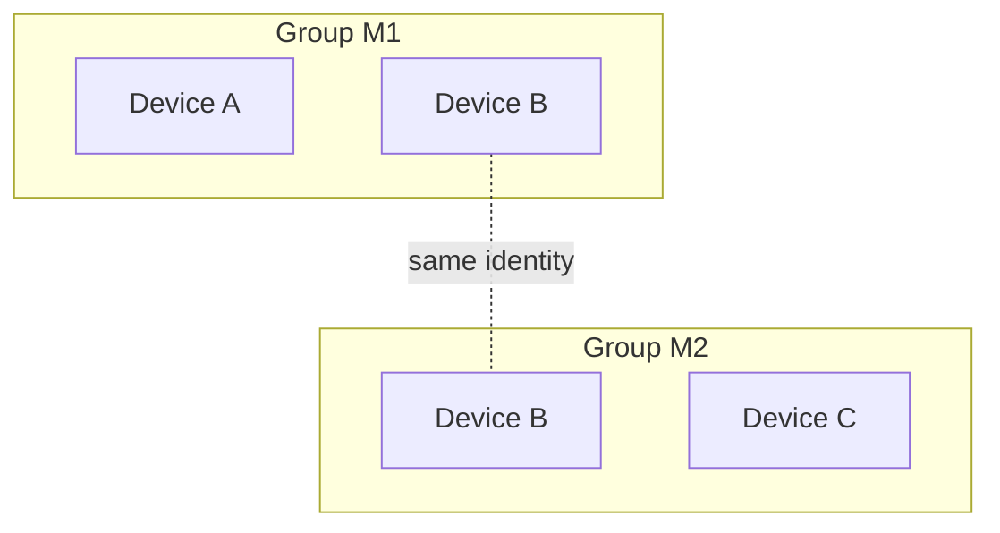

# Multimesh groups design

## Status

Accepted design and the next AFM work item. Nothing here is implemented yet.
It generalizes the single mesh from [QR mesh pairing](../qr-mesh-pairing/plan.md)
into many independent groups per device, and gives the
[first file-transfer roadmap](../first-file-transfer/plan.md) its catalog shape:
one catalog per group instead of one per device mesh. Multi-membership lands
before that roadmap's stage 2 UX, so the file screens are designed around groups
from the start.

Permissions are deliberately absent: every member of a group can do everything
any other member can. Leaving is the one action a device can only take for
itself.

## Outcome

1. A device belongs to any number of **groups**. Each group has a name, a set of
   member devices, and a tree of files, like a shared drive.
2. Any member can add a device to that group, add files and folders, rename or
   move them, remove them, and download any file another member added.
3. Any member can leave a group at any time, including while offline, and can
   be added back later.
4. Groups are isolated. A device only in group A learns nothing about group B:
   not its name, members, addresses, files, or bytes.
5. The same file added to two groups is stored once on a device.
6. Existing AFM installs keep their current mesh as their first group.

## Terms

| Term | Meaning |
|---|---|
| Device | One Spirit node identity (Ed25519 key, iroh endpoint ID). Unchanged. |
| Group | One Spirit mesh. AFM says "group"; Spirit keeps saying "mesh". |
| Member | A device admitted to a group and not departed. Members are devices, not people. |
| Epoch | How many times a device has joined a group, counting from 0. Leaving ends the current epoch, and re-joining starts the next one. |
| Departure | A device's signed record that it left a group at a given epoch. |
| Catalog | AFM's replicated file tree for one group. |
| Store | The device's one content-addressed blob store, shared by all groups. |

## Decisions

### A group is exactly one Spirit mesh

Spirit meshes already have the required no-permissions semantics: random
`mesh1_...` IDs, a signed append-only admission set, and any member may admit
another device. Reusing them avoids a second membership system in AFM.

Alternative rejected: one mesh per device with AFM-level groups inside it. Every
device would then authenticate to every other device's groups, so isolation would
depend on AFM filtering rather than on Spirit's membership checks.

### Members are devices

People are expected to have, for example, a personal group across their phone
and laptops and a work group that only their work laptop joins. Device-level
membership expresses that directly, and each device joins only the groups it
should hold. Account or person identity is not planned.

### One device identity across all groups

A device keeps its single key and endpoint and joins many meshes with it.

| | One identity, many meshes (chosen) | One identity per group |
|---|---|---|
| Endpoints and relay connections | One | One per group |
| Heartbeats to a peer shared by several groups | One | One per group |
| Android battery and background cost | Unchanged | Grows with groups |
| Recognizing the same peer across groups | Yes | No |
| Cross-group linkability | Members of two groups can see they share a device | None |

The linkability cost is acceptable for small personal, friend, and work groups,
and it is stated in the privacy copy. A work laptop that joins only the work
group is not linked to the personal group at all. Per-group identities can be
added later for groups that need them without changing the rest of this design.

### Isolation is enforced by Spirit, per request

Every exchange names one mesh, and the responder authorizes the remote device
against that mesh only:

- Membership snapshots and addresses sent for mesh M contain only M's members.
  `Snapshot::verify` already rejects addresses of non-members.
- A request for a mesh the responder is not in, or that the requester is not
  in, gets the same generic failure. No metadata is returned.
- Ping and presence are per device. A device answers a ping from any device it
  shares at least one mesh with.

Example: B is in groups M1 {A, B} and M2 {B, C}. A and C never learn about each
other or about the other group, A cannot ping C, and B's heartbeat to each peer
only syncs the meshes it shares with that peer.



### The scanner chooses the group

The `spirit1` ticket stays exactly as it is: "add me to a group", with no group
named. The member scanning it chooses the target by opening a group and choosing
**Add device**. The receiving device accepts enrollment into a new mesh instead
of rejecting it because it already belongs to another one. It shows
"Added to *group* by *device*".

The ticket remains a five-minute, single-use bearer credential. Showing it lets
its holder add the device to any one group of their choosing, and the privacy
copy says so. A device added to an unwanted group simply leaves it.

Fresh apps still never create a group on their own. AFM stops creating the
constant `AFM mesh` on the first scan. Users create groups explicitly, and
scanning only happens from inside a group.

### Group files live in an AFM catalog, bytes live in the one store

This keeps the existing ownership boundary: Spirit owns identity, membership,
authorization, and verified bytes; AFM owns names, folders, and the file tree.
Spirit gains no record system or application schema.

- Each group's catalog is a set of signed AFM operations (below), stored under
  AFM's non-backup data directory next to the node identity.
- Bytes are imported once into the device store. A catalog entry refers to them
  by BLAKE3 hash, so the same file in two groups is one blob.
- Adding metadata to a group does not copy bytes to every member. Download stays
  explicit, as in the roadmap.

### Blob access is authorized per group

Knowing a hash must not grant access, including to members of *other* groups on
the same device. Spirit keeps a local, non-replicated **share set** per mesh:

- `share(mesh, hash)` and `unshare(mesh, hash)` are called by AFM.
- A fetch request names `(mesh, hash)`. It is served only if the requester is a
  member of that mesh, the hash is in that mesh's share set, and a verified local
  copy exists. Every other case returns the same "unavailable" error.
- AFM keeps each share set equal to the hashes of live file entries in that
  group's catalog. It reconciles the set at startup and on every catalog change.
  A member that downloads a file can therefore serve it to other members.

Alternatives rejected: letting anyone who shares any mesh fetch any hash leaks
across groups and allows "do you have this file" probing. A Spirit-to-AFM
authorization callback on every fetch ties serving to the app's runtime and
does not suit a store later shared with the CLI or Kai.

### Everyone is equal

No roles, owners, or admin actions. The founder remains only the anchor for
mesh signature validation, as it is now, and is not a coordinator. The founder
can leave like anyone else. Any member can admit devices and change any catalog
entry. Trust is transitive: admitting a device trusts it to admit others.

### Leaving is a signed departure that closes the device's records

A device leaves by signing a departure for its current epoch. Nobody else can
sign one for it, so leaving adds no permission rule. Membership stays
append-only and merges as a plain union of records:

- A device is a current member of a mesh if it has an admission at an epoch
  higher than every departure it has signed for that mesh.
- Re-adding a departed device signs a new admission at the next epoch. The
  normal scan flow does this.
- A departure also closes what the device signed while it was a member. It
  lists the digests of every admission the device issued, including its own
  founding admission if it is the founder. It also carries opaque
  application counters, such as AFM's last catalog sequence number for that
  epoch.
- Once the departure is known, admissions and application records attributed
  to that device are accepted only if the departure covers them. A device that
  has left cannot add devices or catalog changes afterwards, and everything it
  did while it was a member stays valid.

A "left" flag without that closure would still let the departed device's key
admit devices and write catalog entries. It would look like leaving but would
not end the device's ability to act in the group.

Leaving takes effect locally at once, even offline:

1. AFM asks for confirmation.
   - The dialog warns that files only this device holds become unavailable to
     the group.
   - It also warns that catalog changes no other member has acknowledged yet
     will be lost.
   - If this device is the only current member, it says the group will be
     deleted.
2. Spirit signs the departure and marks the mesh **departing**. From then on the
   device does not authorize anyone for that mesh: no app requests, fetches, or
   shares. The only enrollment it accepts is a re-admission at a later epoch,
   which makes it a member again.
3. AFM removes the group from its UI, unshares its hashes, and deletes its
   catalog.
4. Spirit delivers the departure to the group's members on each heartbeat. When
   one member acknowledges it, Spirit deletes the mesh state; members relay it
   from there. If there is no other member, Spirit deletes the mesh immediately.

Files the device downloaded stay in its store until the store has application
references (SPIRIT-02). After that, AFM deletes blobs that no remaining group
references. Until then the confirmation says the bytes stay on the device.

Removing another member is not part of this design. With equal permissions,
any member could remove any other, which needs its own conflict rules.

## Spirit2 changes

These belong in `deps/spirit2` and are reviewed and published there before AFM
moves its pin.

### State

`State.mesh: Option<Mesh>` becomes `meshes: BTreeMap<MeshId, MeshEntry>`, where
an entry is either **member** or **departing**. A departing entry keeps the mesh
records, including its own unpublished departure, only until one member
acknowledges the departure.

The address book stays global and keyed by device, but snapshots filter it to
the mesh's current members. On first open, a legacy `mesh` field migrates into a
one-entry map through the existing atomic write. Legacy mesh IDs and signatures
are kept unchanged. The migration is one-way, so older Spirit builds can no
longer open the node directory; the release notes must say so.

Bounds per device and per mesh:

- At most 64 meshes per device, counting departing ones.
- At most 256 current members per mesh.
- At most 512 membership records (admissions plus departures) per mesh. When a
  mesh reaches this bound, it refuses further joins with an explicit "group
  membership history is full" error. Compacting that history is deferred.

### Membership records

Admissions gain the member's epoch. Their signed tuple becomes
`("spirit/mesh/admission/3", mesh_id, founder, mesh_name, member, epoch, issuer)`.
Existing `/1` and `/2` admissions verify as they do now and count as epoch 0.
New admissions always use `/3`.

A departure is self-signed over
`("spirit/mesh/departure/1", mesh_id, founder, mesh_name, member_id, epoch, issued, closing)`:

- `issued` is the sorted set of digests of the admissions this device signed in
  this mesh during that epoch. A digest is the BLAKE3 hash of the admission's
  signed tuple.
- `closing` maps application protocol names to a final sequence number. At
  most 8 entries are allowed, and names follow the Spirit name rules. Spirit
  signs and relays `closing` without interpreting it.

Verification keeps the existing order-independent trust closure from the
founding admission, with these rules:

- An admission is trusted if it is validly signed and its issuer holds a
  trusted admission. In addition, either the issuer is a current member, or the
  admission's digest is in one of the issuer's departures.
- A departure is accepted if it is self-signed and its member holds a trusted
  admission at that epoch.
- Several admissions of one device at the same epoch, for example from
  concurrent introducers, are all kept. Merge stays a union; records are
  deduplicated by exact bytes. Every admission of a device must carry the same
  nickname, as now.

An issuer persists each admission it signs before sending it. A crash after
sending therefore cannot produce a departure that omits an admission another
device already committed. This changes the current `Node::add` flow, which only
saves the admission after the reply arrives.

### Protocols

New record formats cannot be verified by current peers, so pairing and
membership move to version 2 together. Every device in a group must update, and
a device on `/1` fails its membership sync and appears offline to updated peers.
AFM ships through one prerelease channel, so no `/1` compatibility path is kept.

| Protocol | Behavior |
|---|---|
| `spirit/pair/2` | The receiver joins the snapshot's mesh if it is new, or merges into it if it is already a member, even if it belongs to other meshes. A departing receiver replies with its departure instead. The introducer merges that reply and retries once with an admission at the next epoch, using the same ticket, which is still unconsumed. |
| `spirit/mesh/2` | Uses the same snapshot exchange, routed by the request snapshot's mesh ID, with a 1 MiB message limit. The responder replies with that mesh's snapshot only if both sides are current members. A request whose snapshot contains the requester's own departure is merged and answered with an acknowledgment only, so a departed device cannot keep reading the group's membership. |
| `spirit/ping/1` | Unchanged wire format. It is authorized if the remote device is a current member of any local non-departing mesh. |
| Heartbeat loop | Covers every current member of every mesh this device is in, plus the members of departing meshes until one acknowledges the departure. Each peer gets one ping per interval, preceded by a sync of each mesh shared with that peer. |

### New primitives used by the catalog and transfer

| Primitive | Purpose |
|---|---|
| Mesh-scoped app request (`spirit/app/1`) | Sends an opaque request to one peer, tagged with a mesh ID and an application protocol name such as `afm/catalog/1`. Spirit authenticates the peer and checks that both sides are current members before calling the registered handler with `(mesh, peer, bytes)`. Messages are limited to 256 KiB, with bounded concurrency. |
| Application signatures | `sign(domain, bytes)` and `verify(device, domain, bytes, signature)`, computed over `("spirit/app-signature/1", domain, bytes)`, so application signatures can never be valid admissions. |
| Per-mesh share set and mesh-scoped fetch | As described above; it extends the SPIRIT-05 transfer work. |

### KMP contract sketch

```kotlin
data class MeshMember(val id: String, val epoch: Long)
data class MeshDeparture(val id: String, val epoch: Long, val closing: Map<String, Long>)
data class MeshStatus(
    val id: String,
    val name: String,
    val departing: Boolean,
    val members: List<MeshMember>,
    val departures: List<MeshDeparture>,
)
data class NodeStatus(val id: String, val name: String, val meshes: List<MeshStatus>, val devices: List<NodePeer>)

interface MeshNode {
    suspend fun status(): NodeStatus
    suspend fun createMesh(name: String): String
    suspend fun pair(): PairingInvitation
    suspend fun add(meshId: String, ticket: String): String
    suspend fun leave(meshId: String, closing: Map<String, Long>)
    suspend fun ping(device: String): NodePong
    suspend fun shutdown()
}
```

`members` lists current members with their current epoch. `devices` is the
deduplicated set of peers across all non-departing meshes, each with one
presence value. The CLI gains `--mesh` selection for `mesh add` and
`mesh members`, plus `mesh leave`.

The single-mesh `PairingSession` in the KMP `mesh` module splits into a
node-wide session and a per-group session:

- The node-wide session owns node lifecycle, this device's ticket, device
  presence, and the group list.
- The per-group session owns the group's members, the add-device action, and
  leaving.

## Catalog model

Each group's catalog is an operation-based set in which operations never
conflict. Each operation is stored and exchanged as:

```text
CatalogOp {
  mesh:   MeshId
  author: NodeId
  epoch:  u64            the author's membership epoch in this mesh
  seq:    u64            contiguous per (mesh, author, epoch), starting at 1
  body:   Add { entry: EntryId, kind: File | Folder, path: [segment], hash?, size? }
        | Remove { entry: EntryId }
  signature              Spirit application signature, domain "afm/catalog/op/1"
}
```

- `EntryId` is 16 random bytes. The tree is every `Add` whose entry has no
  `Remove`. A `Remove` that arrives before its `Add` is kept.
- Rename, move, and replace are a `Remove` followed by an `Add` for the same
  hash, so no bytes move.
- Removing a folder removes every entry the remover can see under it. A file
  that another member added concurrently survives, and its folder reappears
  implicitly from its path.
- When two live entries share a path, both are shown, labeled with the author
  device's name. Nothing is renamed or merged automatically.
- An operation is accepted only if all of these hold:
  - its signature verifies and its mesh matches;
  - its author holds a trusted admission at that epoch;
  - either that epoch is still open, or `seq` is at most the author's departure
    `closing["afm/catalog/1"]` for that epoch.

  If a second, different operation arrives for an existing
  `(author, epoch, seq)`, the first is kept and the conflict is surfaced as an
  error.
- A device writes its next `seq` durably before publishing an operation. The
  catalog lives in the same non-backup root as the identity, so they are lost
  together. Re-joining starts a new epoch at `seq` 1, so deleting the catalog on
  leave never reuses a sequence number.
- When leaving, AFM passes its highest published `seq` for the current epoch as
  `closing["afm/catalog/1"]`.
- Entries a departed device added stay in the group. Leaving removes the
  device, not its files.
- Bounds: 1 KiB per path, 64 segments, the Spirit name rules for each segment,
  and 256 KiB per exchange batch.

Signed authorship adds little work now. It keeps "added by" honest when
operations are relayed by other members, and any later permission model needs it.

### Catalog sync

- A group's state summary is a version vector: the highest contiguous `seq`
  seen for each `(author, epoch)`. It is bounded by the 512 membership records
  per mesh.
- Two members exchange vectors over `afm/catalog/1` and send each other the
  missing ranges. Operations relay transitively, so the author does not need to
  be online.
- Sync is triggered by:
  - a local change, which pushes to that group's online members;
  - a peer turning online, which starts a vector exchange;
  - a 60-second anti-entropy exchange with one online member per group.

### Downloads

Provider order is the entry's author if online, then the other online members of
that group. Every fetch names the group. Removing an entry from a group unshares
its hash from that group only. Bytes stay while another group or local retention
still references them. Removal is not erasure, since members who downloaded the
file keep their copies, and the UI must say so.

## AFM changes

- **Groups (home):** a list of groups showing name, member count, online count,
  and file count, plus **New group** and **Join a group**. **Join a group**
  shows this device's ticket QR, which is not tied to any group. Departing
  groups are not listed. A single status line shows how many groups are still
  waiting to notify a member that this device left.
- **Group → Files:** a folder browser with Add file, New folder, rename, move,
  remove, and download. Transfer state follows the roadmap's stage 2 UX.
- **Group → Members:** current members with the existing presence indicator.
  Departed devices are not listed. **Add device** opens the scanner on Android.
  Desktop also needs **Paste code**, because without it a group created on
  desktop could never grow.
- **Leave group:** available on every platform from the group's menu, with the
  confirmation described in [Leaving](#leaving-is-a-signed-departure-that-closes-the-devices-records).
- **Migration:** an existing `AFM mesh` appears as a group with that name.
- **Privacy copy:**
  - Files added to a group are visible to all of its current and future
    members.
  - Leaving does not erase copies other members already downloaded.
  - Being in two groups reveals this device to both.
- **Storage:** catalogs live at `<non-backup node root>/groups/<meshId>/`. They
  hold the operation log and persisted sequence counter, and the materialized
  tree is rebuilt from the log.

## Deferred

- Removing another member, roles, read-only members, and every other
  permission.
- Compacting membership history beyond 512 records per mesh.
- Renaming a group. The mesh name is bound into admission signatures, so a
  rename would be an AFM catalog field.
- Person or account identity. Members are devices by decision, not as an
  interim step.
- Per-group identities for unlinkable membership.
- Per-group default copy levels. A group is the natural place for the folder
  defaults in the roadmap's storage notes.
- File versions, content sync of mutable files, and merging groups.

## Delivery sequence

1. **Spirit2 multi-membership and leaving:**
   - member and departing state, migration, and epoch admissions;
   - departures with closure;
   - `spirit/pair/2` and `spirit/mesh/2`;
   - the union heartbeat and persist-before-send admissions;
   - the KMP contract and the CLI `--mesh` and `mesh leave` commands.

   Also update Spirit's `wiki/design/nodes.md`, which currently says "one
   append-only mesh per device" and lists leaving as deferred.
2. **AFM groups without files:** the groups list, New group, Join a group,
   Members, Add device into the selected group, Paste code on desktop, Leave
   group, and migration of existing installs.
3. **Catalog UX against a fake backend:** fold this into roadmap stage 2 with
   per-group file trees.
4. **Spirit2 app requests, application signatures, share sets, and
   mesh-scoped fetch:** add these to roadmap stages 3a and 3b.
5. **Real catalog sync, catalog closure on leave, and group-scoped downloads:**
   this is roadmap stage 3c.

## Acceptance checks

- With B in M1 {A, B} and M2 {B, C}: A and C each list only their own group's
  members, their membership files never contain the other device or group, A's
  ping to C is refused, and C's sync request naming M1 gets the generic failure.
- Enrolling a device that is already in M1 into M2 keeps M1 intact. Enrolling
  again into M1 is harmless.
- A node directory from the current single-mesh format reopens with the same
  mesh ID, members, and signatures as one group.
- One peer shared through two groups gets one ping per interval and shows one
  presence value.
- Leaving:
  - D leaves M1 while offline. M1 disappears from D at once, and D refuses M1
    requests.
  - When D reconnects, one member receives the departure, D deletes its M1
    state, and every member eventually lists D as gone.
  - D's membership in M2 and its presence there are unaffected.
  - After leaving, D's sync request to M1 gets only an acknowledgment and no
    membership.
  - An admission or catalog operation that D signs after leaving is rejected
    by every member that has the departure. Admissions and operations D signed
    before leaving stay valid, including those of devices D admitted.
  - The founder leaving keeps the mesh valid.
  - The last member leaving deletes the group immediately.
  - Re-adding D by scan produces an epoch-1 admission, including when the
    introducer had not yet seen the departure. D's new catalog operations
    start at `seq` 1 without conflicting with its epoch-0 operations.
  - Concurrent re-admissions by two members converge to one membership.
  - An admission that D sent just before a crash is still listed in D's later
    departure.
  - Reaching 512 membership records gives the explicit history-full error.
- An entry added on A appears on C via B while A is offline. Concurrent
  same-path adds show both entries. Rename and remove converge on every member.
- A member of M2 cannot fetch a hash that is shared only in M1, even if the
  serving device holds it. The same file added to both groups is stored once.
- A forged or tampered operation, a wrong-mesh operation, an operation from a
  non-member, an operation past its author's closing `seq`, or an equivocating
  `(author, epoch, seq)` is rejected.
- Physical-device checks remain separate records, as in the roadmap; loopback
  tests do not prove cross-network behavior.
